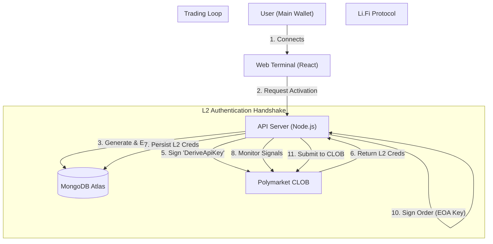

# 🏛️ Bet Mirror Pro | Technical Architecture

> **Enterprise-Grade Trading Infrastructure**
> A hybrid cloud architecture leveraging Dedicated Trading Wallets, MongoDB for robust state persistence, and AI for risk analysis.

---

## 1. System Overview

Bet Mirror Pro solves the complexity of programmatic trading on Polymarket's CLOB. It manages the cryptographic requirements, API handshakes, and execution logic so users can focus on strategy.

### Core Components
1.  **Frontend (React/Vite):** The command center. Users connect wallets, bridge funds, and configure risk profiles.
2.  **Trading Wallets (EOA):** Dedicated Ethereum addresses generated for specific trading sessions.
3.  **Bot Server (Node.js):** A high-frequency engine that monitors the blockchain and executes trades.
4.  **Database (MongoDB Atlas):** Persistent storage for user state, trade history, and **AES-256 Encrypted** keys.

---

## 2. High-Level Data Flow

---

## 3. The Security Hierarchy

To interact with Polymarket's CLOB efficiently, we use a dedicated wallet model.

| Key Type | Location | Storage | Permission Scope |
| :--- | :--- | :--- | :--- |
| **Main Wallet** | User's Device | MetaMask/Phantom | **Fund Source.** Used to deposit to and receive withdrawals from the bot. |
| **Trading Key** | Bot Server | **Encrypted (AES-256)** | **Execution.** Used to sign trades and L2 Auth headers. Generated specifically for the bot. |
| **L2 API Key** | Bot Server | Database | **Messenger.** An HTTP/WS access token used to talk to the Polymarket Matching Engine. |

### Why EOAs instead of Smart Accounts?
We previously utilized ZeroDev Smart Accounts. However, Polymarket's CLOB has strict signature validation requirements that favor standard EOAs (Externally Owned Accounts) for high-frequency trading.
*   **Speed:** EOAs do not require on-chain validation for signatures.
*   **Compatibility:** 100% compatible with Polymarket's `createOrder` endpoints.
*   **Security:** We maintain security by isolating trading funds from the user's main savings.

---

## 4. Data Persistence & Recovery

We use a production-grade **MongoDB** cluster.

### Database Schema Strategy
*   **Users Collection:** Stores `TradingWalletConfig`, `EncryptedPrivateKey`, `BotConfig`, and `L2ApiCredentials`.
*   **Trades Collection:** Immutable log of every action with `AIReasoning`.
*   **Registry Collection:** Tracks `CopyCount` and `ProfitGenerated`.

### Auto-Recovery
1.  **Server Restart:** When the Node.js process restarts, memory is wiped.
2.  **Rehydration:** The server queries MongoDB for all users with `isBotRunning: true`.
3.  **Resume:** The bot decrypts the keys into memory and resumes monitoring immediately.

---

## 5. Technology Stack

*   **Frontend:** React 19, Vite, TailwindCSS, Lucide Icons.
*   **Backend:** Node.js, Express, TypeScript.
*   **Database:** MongoDB Atlas.
*   **Blockchain:** Ethers.js v6.
*   **Bridge:** Li.Fi SDK.
*   **AI:** Google Gemini 2.5 Flash.
