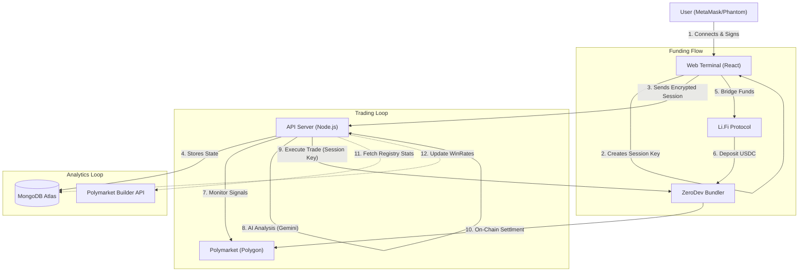

# 🏛️ Bet Mirror Pro | Technical Architecture

> **Enterprise-Grade Trading Infrastructure**
> A hybrid cloud architecture leveraging Account Abstraction for non-custodial security, MongoDB for robust state persistence, and AI for risk analysis.

---

## 1. System Overview

Bet Mirror Pro is designed to solve the "Trust Problem" in automated trading. Traditional trading bots require users to surrender their private keys to a server. If the server is hacked, the user loses everything.

**Our Solution: Account Abstraction (ERC-4337)**
We separate the **Owner** (The User) from the **Trader** (The Bot).

### Core Components
1.  **Frontend (React/Vite):** The command center. Users connect wallets, bridge funds, and configure risk profiles.
2.  **Smart Accounts (ZeroDev/Kernel):** On-chain programmable wallets that hold the funds.
3.  **Bot Server (Node.js):** A high-frequency engine that monitors the blockchain and executes trades using restricted session keys.
4.  **Database (MongoDB Atlas):** Persistent storage for user state, trade history, and encrypted session credentials.

---

## 2. High-Level Data Flow

---

## 3. Account Abstraction & Security Model

We utilize **ZeroDev** and the **Kernel v3.1** smart account standard to implement ERC-4337.

### The Key Hierarchy (Current)

| Key Type | Location | Permission Level | Notes |
| :--- | :--- | :--- | :--- |
| **Owner Key** | User's Wallet | **Root Admin** | Can withdraw funds, revoke keys, update settings. |
| **Session Key** | Server (Encrypted) | **Sudo (Temporary)** | Currently requires Sudo to process Fee Payments (1%). See Phase 4 Roadmap. |

*   **Trust Trade-off:** In the current version, the Session Key has elevated permissions to facilitate the 1% fee transfer.
*   **Mitigation:** The server never stores the Owner Key. The Session Key can be revoked on-chain by the user at any time.
*   **Future (Phase 4):** Moving fee logic to a Smart Contract Module will allow downgrading the Session Key to "Trade Only" scope.

### Trustless Withdrawal
Because the User is the "Owner" of the Smart Contract on the blockchain, they can interact with it directly, bypassing our server entirely.
1.  User signs a `UserOperation` on the frontend.
2.  The operation calls `transfer(usdc, userAddress, balance)`.
3.  The Smart Account executes it immediately.

---

## 4. Data Persistence & Recovery

We have migrated from ephemeral `JSON/LocalStorage` to a production-grade **MongoDB** cluster.

### Database Schema Strategy
*   **Users Collection:** Stores `SmartAccountAddress`, `SerializedSessionKey`, `BotConfig`, and `ActivePositions`.
*   **Trades Collection:** Immutable log of every action with `AIReasoning`.
*   **Registry Collection:** Tracks `CopyCount` and `ProfitGenerated`.

### Auto-Recovery
1.  **Server Restart:** When the Node.js process restarts, memory is wiped.
2.  **Rehydration:** The server queries MongoDB for all users with `isBotRunning: true`.
3.  **Resume:** The bot resumes monitoring from the last known timestamp.

---

## 5. Technology Stack

*   **Frontend:** React 18, Vite, TailwindCSS, Lucide Icons.
*   **Backend:** Node.js, Express, TypeScript.
*   **Database:** MongoDB Atlas.
*   **Blockchain:** Viem, Ethers.js v6, ZeroDev SDK (Kernel v3.1), Li.Fi SDK.
*   **AI:** Google Gemini 2.5 Flash.
