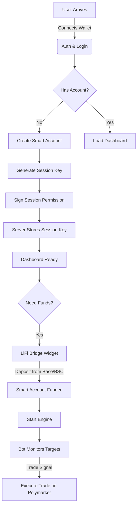

# 🏛️ Bet Mirror Pro | System Architecture

> **World Class Security & Automation**
> A hybrid architecture combining the speed of server-side execution with the security of Account Abstraction.

---

## 1. High Level Overview

The system allows users to "Mirror" (Copy Trade) high-performance wallets on Polymarket. It differentiates itself from standard bots by using **Smart Accounts** to ensure the server never takes custody of user funds.

### The "Trustless" Promise
1.  **Funds** live in a Smart Contract on Polygon.
2.  **User (Owner)** has absolute control (Withdraw/Admin).
3.  **Server (Bot)** has a restricted **Session Key** (Trade Only).
4.  If the server is hacked, the attacker **cannot withdraw**.

---

## 2. User Journey Flow



---

## 3. Security Architecture (Account Abstraction)

We use **ZeroDev (Kernel v3.1)** to implement ERC-4337 Smart Accounts.

### The Key Hierarchy

| Key Type | Held By | Permissions | Security Level |
| :--- | :--- | :--- | :--- |
| **Owner Key** | User's MetaMask / Phantom | `Admin`, `Withdraw`, `Revoke` | 🔴 Critical (Cold) |
| **Session Key** | Bot Server (Node.js) | `CreateOrder`, `CancelOrder` | 🟡 Restricted (Hot) |

### Withdrawal Flow (Trustless)
Even if the server is offline or malicious, the user can withdraw.

1.  User clicks "Withdraw" on Client.
2.  Client SDK creates a `UserOperation`.
3.  **CallData:** `USDC.transfer(UserAddress, Balance)`.
4.  User signs `UserOp` with **Owner Key**.
5.  UserOp is sent to Bundler (ZeroDev).
6.  Smart Account executes transfer.

---

## 4. Cross-Chain Onboarding (LiFi)

We use **LiFi SDK** to abstract the complexity of bridging.

**Scenario:** User has 100 USDC on **Base**.
1.  **Quote:** SDK finds best route (e.g., Stargate or Across).
2.  **Transaction:** User signs 1 TX on Base.
3.  **Execution:**
    - Funds move Base -> Polygon.
    - LiFi Contract calls `transfer` to the User's Smart Account.
4.  **Result:** Bot starts trading immediately on Polygon.

---

## 5. Technology Stack

- **Frontend:** React, Vite, Tailwind, Lucide Icons.
- **Web3:** Viem, Ethers.js, ZeroDev SDK, LiFi SDK.
- **Backend:** Node.js (Express), Polymarket CLOB Client.
- **AI:** Google Gemini 2.5 Flash (Risk Analysis).
- **Database:** JSON (MVP) -> PostgreSQL (Production).

---

## 6. Directory Structure

```
src/
├── app/                 # CLI Entry points
├── config/              # Env variables & Constants
├── domain/              # TypeScript Interfaces (Types)
├── infrastructure/      # External Clients (Polymarket)
├── server/              # Backend API & Bot Engine
├── services/            # Core Logic
│   ├── ai-agent.service.ts       # Gemini Risk Analysis
│   ├── lifi-bridge.service.ts    # Cross-Chain Bridging
│   ├── zerodev.service.ts        # Account Abstraction
│   ├── trade-executor.service.ts # Execution Logic
│   └── web3.service.ts           # Client-side Wallet Interaction
└── utils/               # Helpers
```
