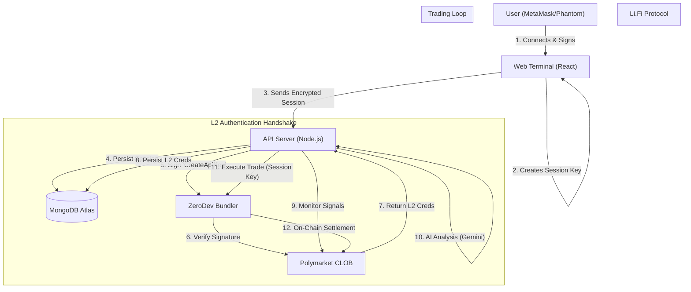

# 🏛️ Bet Mirror Pro | Technical Architecture

> **Enterprise-Grade Trading Infrastructure**
> A hybrid cloud architecture leveraging Account Abstraction for non-custodial security, MongoDB for robust state persistence, and AI for risk analysis.

---

## 1. System Overview

Bet Mirror Pro is designed to solve the "Trust Problem" in automated trading. Traditional trading bots require users to surrender their private keys to a server. If the server is hacked, the user loses everything.

**Our Solution: Account Abstraction (ERC-4337)**
We separate the **Owner** (The User) from the **Trader** (The Bot).

### Core Components
1.  **Frontend (React/Vite):** The command center. Users connect wallets, bridge funds, and configure risk profiles.
2.  **Smart Accounts (ZeroDev/Kernel):** On-chain programmable wallets that hold the funds.
3.  **Bot Server (Node.js):** A high-frequency engine that monitors the blockchain and executes trades using restricted session keys.
4.  **Database (MongoDB Atlas):** Persistent storage for user state, trade history, and encrypted session credentials.

---

## 2. High-Level Data Flow

---

## 3. The Three-Tier Key Hierarchy

To interact with a hybrid exchange like Polymarket, we must bridge the gap between **Blockchain Security** (Signing) and **Web Server Security** (API Access). We use a tiered model to ensure the User's funds are never exposed.

| Level | Key Type | Location | Permission Scope |
| :--- | :--- | :--- | :--- |
| **L1** | **Owner Key** | User's Wallet | **Root Admin.** Can withdraw funds, revoke keys, upgrade contracts. **Never leaves your device.** |
| **L2** | **Session Key** | Bot Server (Encrypted) | **Signer.** Can validly sign trade instructions (UserOps) on behalf of the Smart Account. Cannot withdraw funds. |
| **L3** | **CLOB API Key** | Bot Server (DB) | **Messenger.** An HTTP/WS access token used to talk to the Polymarket Matching Engine. It cannot sign transactions or move funds. |

### The L2 "Handshake"
Why do we store "API Credentials" if we are non-custodial?
1.  **The Problem:** The Polymarket Web Server (CLOB) rejects requests that don't have an `Authorization` header (API Key/Secret), even if the blockchain signature is valid. This is for DDoS protection and rate limiting.
2.  **The Fix:** On the first run, the Bot uses the **Session Key** (L2) to cryptographically sign a message: *"I am this Smart Account, please give me an API Key."*
3.  **The Result:** Polymarket returns a standard API Key/Secret (L3). We store this to maintain a persistent connection.
4.  **Security:** Even if the L3 API Key is stolen, it cannot be used to withdraw funds because it cannot *sign* blockchain transactions. It can only *send* them.

---

## 4. Account Abstraction & Security Model

We utilize **ZeroDev** and the **Kernel v3.1** smart account standard to implement ERC-4337.

### Trustless Withdrawal
Because the User is the "Owner" of the Smart Contract on the blockchain, they can interact with it directly, bypassing our server entirely.
1.  User signs a `UserOperation` on the frontend.
2.  The operation calls `transfer(usdc, userAddress, balance)`.
3.  The Smart Account executes it immediately.

---

## 5. Data Persistence & Recovery

We have migrated from ephemeral `JSON/LocalStorage` to a production-grade **MongoDB** cluster.

### Database Schema Strategy
*   **Users Collection:** Stores `SmartAccountAddress`, `SerializedSessionKey`, `BotConfig`, and `L2ApiCredentials`.
*   **Trades Collection:** Immutable log of every action with `AIReasoning`.
*   **Registry Collection:** Tracks `CopyCount` and `ProfitGenerated`.

### Auto-Recovery
1.  **Server Restart:** When the Node.js process restarts, memory is wiped.
2.  **Rehydration:** The server queries MongoDB for all users with `isBotRunning: true`.
3.  **Resume:** The bot resumes monitoring from the last known timestamp.

---

## 6. Technology Stack

*   **Frontend:** React 18, Vite, TailwindCSS, Lucide Icons.
*   **Backend:** Node.js, Express, TypeScript.
*   **Database:** MongoDB Atlas.
*   **Blockchain:** Viem, Ethers.js v6, ZeroDev SDK (Kernel v3.1), Li.Fi SDK.
*   **AI:** Google Gemini 2.5 Flash.
